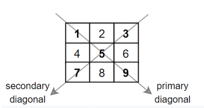
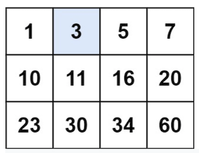

###### CS-324-2: Introduction to the Design of Algorithms <br> Spring 2021 <br> Northeastern Illinois University <br> Homework #1B <br> Suggested Due Date: 01/20/21 <br> Due Date: 02/10/21 at 9:00 p.m. (CT) <br> Algorithms and Efficiency

**Getting Started**

**1.** Accept the assignment invitation on D2L.<br>
**2.** Clone the assignment to your computer.<br>
**3.** Go to File > Project Structure. Under Project Settings, click on Project and verify that the Project SDK is set to JDK 11 or higher.  If it is not, select the correct SDK from the drop-down.<br>
**4.** Go to File > Settings (Mac: IntelliJ IDEA > Preferences). Under Build, Execution, Deployment and under Build Tools, click Gradle. Make sure Build and run using: and Run tests using: are set to Gradle. Make sure Use Gradle from: is set to 'gradle-wrapper.properties' file. And make sure Gradle JVM is set to JDK 11 or higher.<br>
**5.** Project SDK and Gradle JVM should be set to the same Java version.<br>
**6.** Create the main/java directory in the src directory. This is where you will be creating your Java classes for your assignment. Right click src and go to New > Directory and select main/java.<br>

**Submitting your assignment**

**1.** Once you have completed all the problems, commit your final code to GitHub. <br>
- Please also commit code after each step of each problem and remember to run the unit tests (where applicable) and code analyzers before you commit.

**2.** Then in IntelliJ, go to File, select Export to Zip File. This will a create a zip file of the entire project directory.<br>
**3.** Submit the .zip file to the Homework 1B Assignment folder on D2L.<br>

**Coding Rules**

**1.** Unless specified in the instructions, you may not use any String variables or any String methods.<br>
**2.** Unless specified in the instructions, you may not use any built in Array methods.<br>
**3.** Unless specified in the instructions, you may not import anything from the Java API.<br>
**4.** Note that while having all the unit tests and pmd/checkstyle tests is the first step for your code to be considered correct, this
does not necessarily mean the algorithm is correct.<br>
**5.** Reminder: All code must be your own work.

**Running Tests and Code Analyzers**

**1.** To run the tests when indicated, click the green arrow to the left of each header to run the tests individually or
click the green arrow to the left of the class header to run all the tests. If they do not pass, your code is incorrect,
and you should continue to work on the problem.<br>
**2.** If the unit tests pass, you can run the code analyzers. On the right side, click Gradle, expand Tasks > other. Double click the
checkstyleMain task to run it. If any rules were violated, you will be shown your errors. You can click the link provided then
choose your browser of choice at the top-right corner to view the error description or in the bottom left panel, click the middle
red exclamation point to view the error. Fix the issue and rerun the checkstyleMain, repeat if necessary.<br>
**3.** Once the checkstyleMain task has passed, double-click on the pmdMain task in the same panel. If a rule violation was found, click the
provided link, then choose your preferred browser in the top right to view the error description. Fix the issue and rerun the pmdMain task, repeat if necessary.<br>
**4.** When the unit tests and code analyzers have passed, open GitHub Desktop. You will be able to see the files that have been changed in the left panel. Enter a
summary in the bottom left then click "Commit to main". Then click Push Origin in the right panel at the top. <br>
**5.** If you go to your GitHub account and go to the Actions tab for this assignment repository, you can see the Workflow running.

## **Problem 1**

**1.** In the main/java directory, create a class named `Problem1`.
- Create a static method named `addDiagonals`. This method should take a 2D integer array parameter and return an integer.
  You can assume that the 2D array parameter is a square array (i.e. matrix), meaning that it has the same number of rows
  and columns. The method should return the sum of the matrix diagonals. Only include the sum of all the elements on the
  primary diagonal and all the elements on the secondary diagonal that are not part of the primary diagonal.
- Your code should run in <em>O</em>(<em>n</em>) time. Include a comment at the top of the file that lists your basic
  operation, and a justification as to why your algorithm is <em>O</em>(<em>n</em>).





- Uncomment the body of the tests in the `TestAddDiagonals` class in the test/java directory to test this method. Run the tests.
- Run the Code Analyzers.
- Push your code to GitHub.

## **Problem 2**

**1.** In the main/java directory, create a class named `Problem2`.
- Create a static method named `onesAtEnd`. This method should take a 1D integer array parameter and does not return anything
  (i.e. `void`). This method should move all the 1's to the end of the array while maintaining the relative order of the
  other elements. You must do this <b>in-place</b> without making a copy of the array (i.e. you may not create an array in
  this problem!). For example, `[1, 9, 1, 4, 5]` will end up being `[9, 4, 5, 1, 1]`.
- Using big-O notation, determine the running time of your algorithm. Put this as a comment at the top of your file.
  Include a justification as to why your algorithm has that running time.
- Uncomment the body of the tests in the `TestOnesAtEnd` class in the test/java directory to test this method. Run the tests.
- Run the Code Analyzers.
- Push your code to GitHub.

## **Problem 3**

**1.** In the main/java directory, create a class named `Problem3`.
- Create a static method named `search2DArray`. This method should take a sorted 2D integer array parameter (<em>m</em> rows x <em>n</em> columns)
  and an integer parameter representing the key, and return a boolean. This method should return true if the key can be
  found in the 2D array and false otherwise. The 2D array parameter has the following properties:
  - Integers in each row are sorted from left to right.
  - The first integer of each row is greater than the last integer of the previous row.





- Your algorithm must run in under <em>O</em>(<em>m</em> * <em>n</em>) time - so either
  <em>O</em>(<em>m</em> + <em>n</em>) or <em>O</em>(<em>m</em> + log <em>n</em>) time.
- Hint: Remember from the lecture what the running time is for binary search. How can you leverage the binary search algorithm?
  This algorithm may be in your book...on page 10. Be careful of indices!!
- Using big-<em>O</em> notation, determine the running time of your algorithm. Put this as a comment at the top of your file.
  Include a justification as to why your algorithm has that running time.
- Uncomment the body of the tests in the `TestSearch2DArray` class in the test/java directory to test this method. Run the tests.
- Run the Code Analyzers.
- Push your code to GitHub.

## **Problem 4**

**1.** In the main/java directory, create a text file named `Problem4.txt`. Answer each of the questions in the text file clearly.
Make sure to label your answers. You will be asked to resubmit your work if your answers are wrong or missing components.

**(a)** What is the big-<em>O</em> runtime of the following code and why?<br>

```
public int foo(int a, int b) {
  if (b <= 0)
    return -1;
  int d = a / b;
  return a - d * b;
}
```

**(b)** What is the big-<em>O</em> runtime of the following code and why?<br>

```
public int bar(int n) {
  return foo(n, 1, n);
}

public int foo(int n, int min, int max) {
  if (max < min)
    return -1;
  
  int guess = (min + max) / 2;
  if (guess * guess == n)
    return guess;
  else if (guess * guess < n)
    return bar(n, guess + 1, max);
  else
    return bar(n, min, guess - 1);
}
```

**(c)** Which of the following are equivalent to <em>O</em>(N)? For each choice, explain why or why not.<br>

(i) <em>O</em>(N + P), where P = N/2<br>
(ii) <em>O</em>(2N + 1)<br>
(iii) <em>O</em>(3N + 5log N)<br>
(iv) <em>O</em>(N + M)


